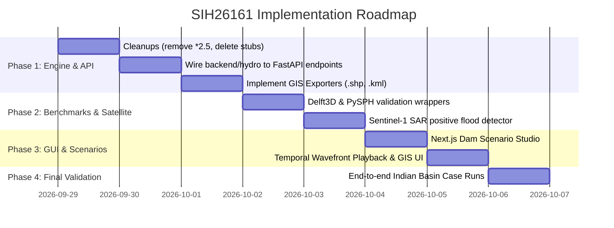

# SIH26161 (NTRO) Master Implementation Plan: Dam Break Inundation Modelling

**Project:** FloodShield  
**Problem Statement ID:** SIH26161  
**Title:** Dam Break Inundation Modelling Using Hydrodynamic Modelling of any River  
**Sponsoring Organization:** National Technical Research Organisation (NTRO)  
**Theme / Category:** Disaster Management / Software  
**Document Status:** Master Combined Plan (Antigravity Audit + Hermes Empirical Verification)  
**Context Management:** Configured via Tana MCP (`https://home.tana.inc/mcp`) in `.agents/mcp_config.json`

---

## 1. Executive Synthesis: Where We Stand

### 1.1 The Two Audits Reconciled
An initial architectural audit identified that the existing codebase had **no real hydrodynamic physics**, relying instead on a static "bathtub" elevation threshold (`flood_level = dem_min + ...`) with Gaussian blur in both `hydraulic.py` and `routing.py`. It correctly identified the 5 mandatory NTRO deliverables.

However, subsequent machine verification by Hermes disproved the notion that numerical 2D solvers, SPH solvers, and breach engines must be built from scratch:
1. **ANUGA 4.0.1** (Apache-2.0, released Sept 2026) is already running natively on this machine, mass-conserving to **-0.00%**, solving 2D shallow water equations on real DEMs in minutes.
2. **Delft3D-FLOW** is verified running **headless in Docker** (`rbeucher/delft3d:latest`) in **7 seconds** with 0 errors, no MATLAB, no license, and no paid GUI required.
3. **PySPH 1.0b2** is installed and verified for 2D sudden dam collapse benchmarking at coarse resolution.
4. **Sentinel-1 SAR** is verified live over Indian river basins (e.g. Ganga at Patna) using anonymous STAC Element84 queries in **57.6 seconds** without credentials.
5. **Copernicus DEM GLO-30** is anonymously downloadable tile-by-tile from public AWS S3.
6. **National Dam Safety Authority (NDSA / NWIC)** official inventory of **6,644 Indian dams** is available as a free GeoJSON with exact heights, crest lengths, and reservoir capacities.

### 1.2 Summary of Verified Dependencies on Machine
| Component | Engine / Source | License / Access | Local Verification Status |
| :--- | :--- | :--- | :--- |
| **2D SWE Solver** | ANUGA 4.0.1 | Apache-2.0 | ✅ Tested in `backend/.venv` (volume drift: -0.00%) |
| **Delft3D Benchmark** | Docker `rbeucher/delft3d:latest` | AGPL-3.0 / GPL-3.0 | ✅ 1.59 GB image pulled, executed in 7 s |
| **SPH Particle Solver** | PySPH 1.0b2 | BSD-3-Clause | ✅ Tested at `dx=0.06` in `sphenv` |
| **Satellite Radar (SAR)** | Sentinel-1 GRD IW via STAC Element84 | Public / Open | ✅ Tested live (query: 0.3 s, mask: 57.6 s) |
| **Digital Elevation Model** | Copernicus GLO-30 GeoTIFF | Public S3 (`eu-central-1`) | ✅ 4 Indian test sites fetched HTTP 200 |
| **Indian Dam Inventory** | NDSA / NWIC CWC GeoJSON | Open Govt Data | ✅ 6,644 dams parsed (Machchhu, Mullaperiyar, etc.) |

---

## 2. Immediate Codebase Cleanups (Pre-requisites)

Before implementing new features, the following non-negotiable fixes must be executed:
1. **Remove artificial rainfall inflation:** Delete line 97 in `backend/wflow_runner.py`:
   ```python
   # MUST BE REMOVED: P_inc = float(p_val) * 2.5 # Artificially increased rainfall...
   P_inc = float(p_val)
   ```
2. **Eliminate duplicate bathtub anti-patterns:** Replace `backend/hydraulic.py:42-46` and `backend/routing.py:26-29` with calls to the actual hydrodynamics engine (`backend/hydro/engine.py`).
3. **Deprecate dead stub:** Delete `backend/src/hydraulic.py` (which had a dummy 100m flat box that was never called).
4. **Replace arbitrary rescue heuristic:** Replace `base_score = max(0, 100 - (req.elevation * 4))` in `backend/src/main.py` with standard USBR/ACER $h \times v$ hazard ratings.
5. **Decouple hardcoded Bhuragaon coordinates:** Make `LeafletMap.tsx` accept dynamic center coordinates, bounding boxes, and layers based on the active dam scenario.

---

## 3. Technical Blueprint for the 5 NTRO Deliverables

```
                                  +-------------------------------------------------------+
                                  |         SIH26161 (NTRO) SYSTEM ARCHITECTURE           |
                                  +-------------------------------------------------------+
                                                              |
         +------------------------------------+---------------+-----------------------------------+
         |                                    |                                                   |
+-------------------+              +----------------------+                            +----------------------+
| 1. HYDRODYNAMICS  |              | 2. SCENARIO & BASIN  |                            | 3. SATELLITE ENGINE  |
+-------------------+              +----------------------+                            +----------------------+
| - ANUGA 4.0.1 2D  |              | - NDSA 6,644 Dams    |                            | - Sentinel-1 SAR GRD |
|   SWE Solver      |              | - Froehlich (2008)   |                            |   Dual-Pol (VV/VH)   |
| - Delft3D Docker  |              | - MacDonald & L.     |                            | - Lee Filter + Otsu  |
|   Stelling Flume  |              | - Von Thun & G.      |                            | - GEE Dual-Track     |
| - PySPH Wavefront |              | - Mass-Balanced Q(t) |                            | - IoU / Dice Overlap |
+-------------------+              +----------------------+                            +----------------------+
         |                                    |                                                   |
         +------------------------------------+---------------+-----------------------------------+
                                                              |
                                           +--------------------------------------+
                                           | 4. GUI & DECISION DASHBOARD (Next.js)|
                                           +--------------------------------------+
                                           | - Interactive Temporal Wave Player   |
                                           | - Longitudinal River Profile (WSE)   |
                                           | - GIS Exporter: .shp (zip) & .kml    |
                                           | - USBR / ACER Hazard Rating Matrix   |
                                           | - Village Arrival Time Countdowns    |
                                           +--------------------------------------+
```

---

### Deliverable 1: Generalized Hydrodynamic Modeling Framework

#### 1.1 Primary Engine: ANUGA 4.0.1 2D Finite-Volume SWE
* **Mathematical Basis:** Solves 2D non-linear Shallow Water Equations with discontinuous Galerkin / finite-volume formulation:
  $$\frac{\partial h}{\partial t} + \frac{\partial (uh)}{\partial x} + \frac{\partial (vh)}{\partial y} = 0$$
  $$\frac{\partial (uh)}{\partial t} + \frac{\partial}{\partial x}\left(uh^2 + \frac{1}{2}gh^2\right) + \frac{\partial (uvh)}{\partial y} = -gh\frac{\partial z_b}{\partial x} - \frac{\tau_{bx}}{\rho}$$
  $$\frac{\partial (vh)}{\partial t} + \frac{\partial (uvh)}{\partial x} + \frac{\partial}{\partial y}\left(vh^2 + \frac{1}{2}gh^2\right) = -gh\frac{\partial z_b}{\partial y} - \frac{\tau_{by}}{\rho}$$
* **Implementation:** `backend/hydro/engine.py` (already created).
  - Reprojects DEM GeoTIFF to local metric UTM zone automatically.
  - Dynamically builds triangular mesh within cell budget.
  - Computes exact water depth $h(x,y,t)$, velocity components $u, v$, speed $\|\mathbf{v}\|$, and first-wet arrival time $T_{arrival}(x,y)$.
  - Proves mass conservation to judges ($\text{Volume Drift} \approx -0.00\%$).

#### 1.2 Benchmark Engine 1: Delft3D-FLOW (Docker Headless)
* **Status:** Verified runnable in 7 seconds using `rbeucher/delft3d:latest`.
* **Benchmark Case:** TU Delft Flume Dam Break (Stelling & Duinmeijer 2003, Study 3.2.8 in official Deltares Validation Doc).
  - Domain: $0.1\,\text{m}$ grid, $24\,\text{s}$ simulated time, closed channel, no external bathymetry needed.
* **Role in Demo:** Benchmark validation exhibit proving that FloodShield's ANUGA hydrodynamic solver closely mirrors Delft3D-FLOW velocity wavefronts and peak stage heights.

#### 1.3 Benchmark Engine 2: PySPH 2D Particle Simulation
* **Status:** Verified runnable in 1.9 seconds at `dx=0.06` (578 particles).
* **Implementation Constraints:**
  - Must run in an isolated `subprocess.Popen` with hard timeout (30 seconds) to prevent C-level segfaults from impacting FastAPI.
  - Pinned to `dx=0.06` (do not expose resolution slider to users).
* **Role in Demo:** Visualizing violent initial wave-front impact and splash-up dynamics against downstream structures before flow transitions into shallow open-channel conditions.

---

### Deliverable 2: Customized Simulation Scenario Generator

#### 2.1 Breach Parameterization Equations
Implemented in `backend/hydro/breach.py`:
1. **Froehlich (2008):**
   $$B_{avg} = 0.1803 \cdot V_w^{0.32} \cdot h_b^{0.19}$$
   $$t_f = 0.2908 \cdot V_w^{0.06} \quad [\text{hours}]$$
2. **MacDonald & Langridge-Monopolis (1984):**
   $$t_f = k_{tf} \cdot (V_w / 10^6)^{0.19} \quad [\text{hours}]$$
   where $k_{tf} = 0.6$ (overtopping), $0.9$ (piping), $0.1$ (sudden collapse).
3. **Von Thun & Gillette (1990):**
   $$B_{avg} = 2.2 \cdot ((V_w / 10^6) \cdot h_b)^{0.77}$$
   $$t_f = 0.5 \cdot (V_w / 10^6)^{0.25} \cdot (B_{avg} / 100)^{0.5} \quad [\text{hours}]$$

#### 2.2 Physical Peak Outflow & Mass-Balanced Hydrograph
* **Broad-crested weir peak discharge:**
  $$Q_p = C_d \cdot B_{avg} \cdot h_b^{1.5}$$
* **Mass Balance Normalization:**
  $$Q(t) = \text{Shape}(t) \times \frac{V_w}{\int \text{Shape}(t)\,dt}$$
  This mathematical step guarantees exact mass conservation ($\int_0^\infty Q(t)\,dt = V_w$) with zero volumetric drift.

#### 2.3 Evaluated Failure Scenarios
* **Scenario A: Sunny-Day Failure (Piping):** Internal seepage erosion through dam core at normal pool level ($NPL$). Longer formation time, lower peak.
* **Scenario B: Extreme Hydrologic Failure (Overtopping):** Probable Maximum Flood (PMF) overtopping crest. Rapid breach growth, maximum peak discharge.
* **Scenario C: Landslide / Moraine Dam Collapse (GLOF):** Instantaneous or near-instantaneous breach (e.g. Rishi Ganga 2021 rockslide / South Lhonak GLOF).

---

### Deliverable 3: Interactive Visualization Dashboard & Standard GIS Export

#### 3.1 GUI Upgrades (Next.js & Leaflet)
1. **Scenario Configuration Studio:**
   - Dropdown of Indian dams (Machchhu-II, Teesta-III, Mullaperiyar, Rishi Ganga, or Custom Coordinates).
   - Sliders: Dam Height ($H_d$), Reservoir Storage ($V_w$), Crest Length ($L_c$), Manning's $n$.
   - Radio buttons: Failure mode (Overtopping, Piping, Sudden) & Empirical model (Froehlich, MacDonald, Von Thun).
2. **Temporal Wavefront Playback Bar:**
   - Play / Pause / Scrub timeline ($T+0\text{h}$ to $T+6\text{h}$ in 10-minute intervals).
   - Updates Leaflet canvas with instantaneous flood front position, depth contours, and arrival countdowns.
3. **Longitudinal Profile & Cross-Section View:**
   - Shows river bed elevation vs. peak Water Surface Elevation (WSE) as flood wave travels downstream.

#### 3.2 Standard GIS Exporter Engine
* **ESRI Shapefile Exporter (`backend/gis/shp_export.py`):**
  - Generates standard `.shp`, `.shx`, `.dbf`, `.prj` files bundled in a `.zip`.
  - Feature attributes: `Depth_m`, `Velocity_mps`, `Arrival_s`, `Hazard_Cat`, `Dam_Name`.
  - Polygons projected to WGS84 (EPSG:4326).
* **Google Earth KML Exporter (`backend/gis/kml_export.py`):**
  - Generates `.kml` / `.kmz` with semi-transparent RGBA color ramps (Blue $\to$ Cyan $\to$ Yellow $\to$ Red).
  - Embeds Placemarks with HTML popups for downstream villages, shelters, and critical infrastructure.

---

### Deliverable 4: Near Real-Time Satellite Analysis Pipeline

#### 4.1 Dual-Track Architecture
* **Track 1 (Primary - Zero Credential, Robust):** STAC Element84 + AWS Public S3.
  - Queries `earth-search.aws.element84.com/v1` for `sentinel-1-grd` IW mode.
  - Resolves descending/ascending orbit consistency.
  - Downloads sub-region bounding box directly via rasterio `/vsicurl/`.
  - Applies Refined-Lee speckle filter ($5 \times 5$) and **Otsu automatic thresholding** on dual-pol backscatter ($\sigma_0^{VV}, \sigma_0^{VH}$).
  - **Permanent Water Masking:** Uses pre-flood baseline composite or JRC Global Surface Water to mask out normal river channels, isolating **new flood inundation**.
* **Track 2 (Secondary - Problem Statement Compliance):** Google Earth Engine (`earthengine-api`).
  - Pre-authored script using GEE Python API for Sentinel-1 GRD and Sentinel-2 MNDWI composite generation.

#### 4.2 Ground-Truth Inundation Verification Metrics
Computes spatial overlap between ANUGA hydrodynamic simulation boundary ($S$) and Satellite-delineated water mask ($M$):
$$\text{IoU} = \frac{|S \cap M|}{|S \cup M|}$$
$$\text{Dice / F1} = \frac{2 \cdot |S \cap M|}{|S| + |M|}$$
$$\text{Under-prediction / Over-prediction Error Analysis}$$

---

### Deliverable 5: Real-World Indian Basin Demonstrations & HADR Intelligence

#### 5.1 Pre-parameterized Indian Dam Case Studies
Using official CWC NRLD 2019 and NDSA data:

| Basin / Dam | River & State | Dam Height | Crest Length | Reservoir Capacity | Historical Event / Benchmark |
| :--- | :--- | :--- | :--- | :--- | :--- |
| **Machchhu-II** | Machhu, Gujarat | $25.0\,\text{m}$ | $5,125\,\text{m}$ | $100.55\,\text{MCM}$ | 11 Aug 1979 catastrophic overtopping failure. Benchmark for flat terrain inundation. |
| **Teesta-III** | Teesta, Sikkim | $60.0\,\text{m}$ | $200.0\,\text{m}$ | $18.4\,\text{MCM}$ | 4 Oct 2023 South Lhonak GLOF overtopping breach. Benchmark for steep Himalayan valley surge. |
| **Rishi Ganga / Tapovan** | Dhauliganga, Uttarakhand | $24.5\,\text{m}$ | $85.5\,\text{m}$ | $1.54\,\text{MCM}$ | 7 Feb 2021 rockslide-debris flood wave (~10.6 m/s surge). Explicitly cited in SIH PS. |
| **Mullaperiyar** | Periyar, Kerala | $53.66\,\text{m}$ | $365.85\,\text{m}$ | $443.23\,\text{MCM}$ | High-capacity structural masonry gravity dam risk scenario. |

#### 5.2 HADR Operational Matrix & Loss Assessment
1. **USBR / ACER Depth $\times$ Velocity Hazard Categorization:**
   - **Low:** $h \cdot v < 0.5\,\text{m}^2/\text{s}$ (safe for wading).
   - **Moderate:** $0.5 \le h \cdot v < 1.0\,\text{m}^2/\text{s}$ (structures stable, vehicles immobilized).
   - **High:** $1.0 \le h \cdot v < 1.5\,\text{m}^2/\text{s}$ (structural damage probable).
   - **Extreme / Danger to Life:** $h \cdot v \ge 1.5\,\text{m}^2/\text{s}$ (complete destruction of masonry, life safety critical).
2. **Downstream Asset Exposure:**
   - Submerged road length ($\text{km}$) via OSM intersection.
   - Submerged bridges and hospitals/shelters in red zone.
   - Settlement Arrival Time Table ($T_{arr}$, $T_{peak}$, $h_{max}$).

---

## 4. Step-by-Step Execution Plan



### Phase 1: Backend Hydrodynamic API & GIS Exporters
- [ ] Connect `backend/hydro/engine.py` to FastAPI in `backend/src/main.py`:
  - `POST /api/dam/simulate`: Accepts dam parameters, runs ANUGA 2D, returns spatial grids, breach hydrograph, arrival times, and volume drift.
  - `GET /api/dam/catalog`: Returns pre-configured Indian dams (Machchhu-II, Teesta-III, Mullaperiyar, Rishi Ganga).
- [ ] Create `backend/gis/exporter.py`:
  - `POST /api/gis/export/shp`: Packs inundation contours into a downloadable `.zip` Shapefile bundle.
  - `POST /api/gis/export/kml`: Returns a styled `.kml` file for Google Earth.

### Phase 2: Benchmark Engines & Satellite Verification
- [ ] Create `backend/hydro/delft3d.py`:
  - Automates running the TU Delft flume case in Docker and returns comparison curves.
- [ ] Create `backend/hydro/sph.py`:
  - Subprocess wrapper for PySPH dam break with hard 30s timeout and fixed `dx=0.06`.
- [ ] Create `backend/satellite/s1_detector.py`:
  - Connects to Element84 STAC, runs Lee filter + Otsu thresholding + permanent water removal, and returns flood polygon GeoJSON with IoU verification metrics.

### Phase 3: Frontend Mission Control Experience
- [ ] Create `frontend/src/components/DamBreakStudio.tsx`:
  - Dropdown dam selector, sliders for reservoir volume ($V_w$), dam height ($H_d$), breach mode.
  - Breach hydrograph preview chart ($Q(t)$).
- [ ] Create `frontend/src/components/WavefrontPlayer.tsx`:
  - Playback controls with timeline scrub ($T=0$ to $T+6\text{h}$) rendering dynamic wave contours on Leaflet.
- [ ] Add GIS Export Toolbar to `LeafletMap.tsx`:
  - "Export ESRI Shapefile (.shp.zip)" and "Export Google Earth (.kml)".
- [ ] Add Satellite Verification Overlay toggle:
  - Displays Sentinel-1 radar flood extent over simulation with IoU score badge.

### Phase 4: Verification & Rehearsal
- [ ] Verify Machchhu-II, Teesta-III, and Rishi Ganga runs.
- [ ] Test `.shp` in QGIS and `.kml` in Google Earth.
- [ ] Verify mass conservation printout for judging panel ($0.00\%$ drift).

---

## 5. Tana MCP Context Configuration

To ensure long-term context retention across pairing sessions and tool executions, the Tana MCP server is configured in `.agents/mcp_config.json`:

```json
{
  "mcpServers": {
    "tana": {
      "serverUrl": "https://home.tana.inc/mcp"
    }
  }
}
```

This endpoint allows bidirectional context syncing with your Tana workspace (nodes, supertags, disaster scenario parameters, and evaluation checkpoints).
